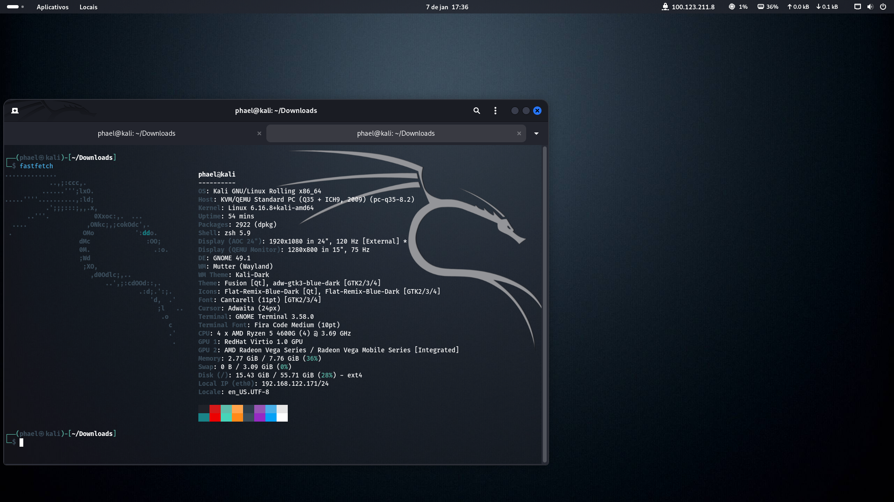

# Laboratório de Cibersegurança e Análise de Malware (ISO-LAB-01)

> **Objetivo:** Criar um ambiente isolado de alta performance para estudos de Pentest e Engenharia Reversa, utilizando virtualização de baixo nível.

---

## 1. Especificações do Host
O hardware foi configurado para suportar múltiplas instâncias de virtualização com foco em estabilidade e performance.

* **Processador:** AMD Ryzen 5 4600G
* **Memória:** 32GB RAM DDR4
* **Gráficos:** * **AMD Radeon Vega 7** (Dedicada via IOMMU para a VM)
    * **NVIDIA RTX 3070** (Utilizada pelo Host Linux Mint)
* **Sistema Operacional:** Linux Mint (Base Debian/Ubuntu)

### Configuração de Hardware (BIOS/UEFI)
Para viabilizar o **GPU Passthrough**, foram habilitados recursos avançados na placa-mãe:
* **IOMMU:** Ativado para permitir o isolamento de dispositivos PCI.
* **UMA Frame Buffer:** Alocação de 2GB de VRAM para a GPU integrada.

*Legenda: Habilitação do suporte IOMMU na BIOS Gigabyte.*

*Legenda: Alocação de 2GB para o UMA Frame Buffer Size.*

---

## 2. Arquitetura da Máquina Virtual (Kali Linux)
A VM foi configurada via **KVM/QEMU** para garantir o menor overhead possível.

* **Hipervisor:** Virt-Manager (KVM/QEMU).
* **Recursos:** 8GB RAM | 60GB Armazenamento (QCOW2).
* **Aceleração Gráfica:** GPU Passthrough nativo da Vega 7.

*Legenda: Gerenciamento da VM KaliLinux em execução via Virt-Manager.*

*Legenda: Processo de deploy e instalação do sistema básico Kali.*

---

## 3. Ambiente de Operação e Networking
O sistema operacional convidado (Guest) utiliza a interface GNOME 47.1 e ferramentas de rede para laboratórios externos.

* **Interface:** GNOME 47.1 com aceleração via hardware (GPU 2: AMD Radeon Vega Series).
* **Rede Mesh:** Implementação do **Tailscale** (IP 100.123.211.8) para acesso remoto seguro.
* **VPN de Laboratório:** Conexão via **OpenVPN** para plataformas como TryHackMe.

*Legenda: Dashboard do sistema com Fastfetch exibindo a aceleração via Vega 7 e rede Tailscale ativa.*

*Legenda: Túnel OpenVPN estabelecido com sucesso para laboratórios de Pentest.*

---

## 4. Segurança e Isolamento
Seguindo as melhores práticas de cibersegurança, o ambiente mantém um protocolo rígido de **"No-Personal-Data"**, garantindo que malwares (como Infostealers) não tenham acesso a credenciais sensíveis do Host ou do usuário.
